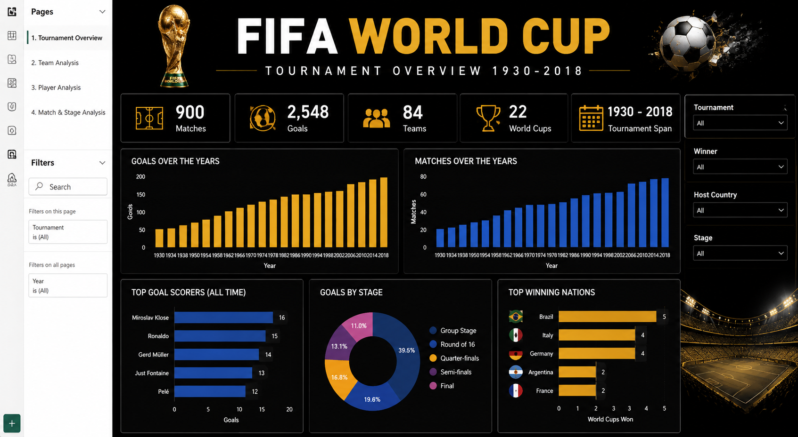
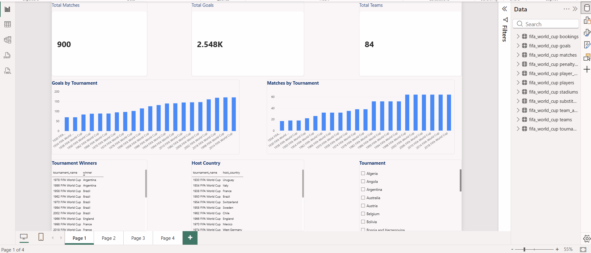
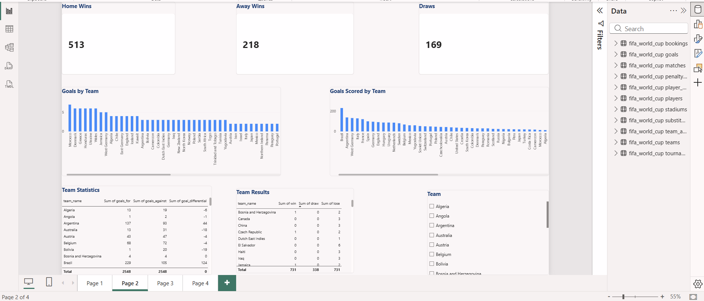
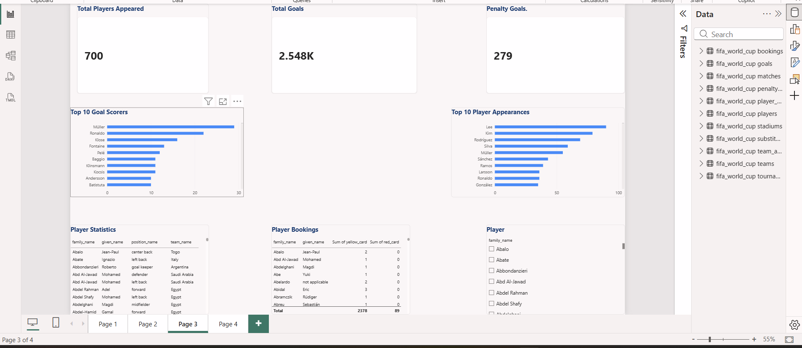
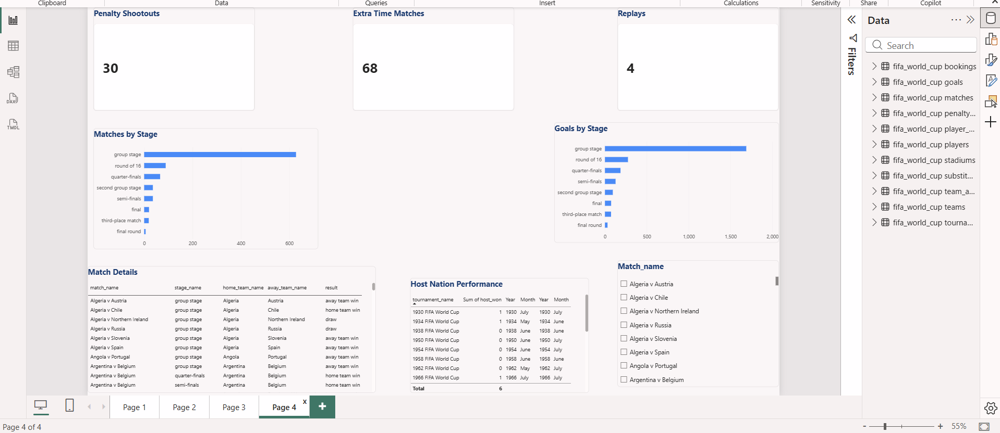

# 🏆 FIFA World Cup Analytics Dashboard (1930–2018)

## 📌 Project Overview
This project is an end-to-end SQL and Power BI analytics solution built using historical FIFA World Cup data (1930–2018).

The objective was to transform raw football data into an interactive business intelligence dashboard that provides meaningful insights into tournaments, teams, players, matches, and competition statistics.

---

# 📊 Dashboard Overview

## Cover

---

## Page 1 – Tournament Overview

### Key Insights
- Total tournaments played
- Total matches
- Total goals scored
- Total participating teams
- Tournament winners
- Host countries
- Goals scored by tournament
- Matches played by tournament

---

## Page 2 – Team Performance

### Key Insights
- Home wins
- Away wins
- Draws
- Goals scored by team
- Team statistics
- Win / Draw / Loss analysis
- Team performance comparison

---

## Page 3 – Player Analysis

### Key Insights
- Total players appeared
- Total goals
- Penalty goals
- Top goal scorers
- Top player appearances
- Player statistics
- Player bookings

---

## Page 4 – Match Analysis

### Key Insights
- Penalty shootouts
- Extra time matches
- Replays
- Goals by stage
- Matches by stage
- Match details
- Host nation performance

---

# 🛠️ Tools & Technologies

- SQL
- Microsoft Power BI
- Power Query
- Data Modelling
- DAX
- Data Visualization

---

# 📈 Project Workflow

1. Data Collection
2. SQL Data Exploration
3. Data Cleaning
4. Data Modelling
5. Power BI Dashboard Development
6. KPI Creation
7. Interactive Dashboard Design

---

# 🎯 Business Value

This dashboard enables users to:

- Analyse historical FIFA World Cup tournaments
- Compare team performances
- Explore player statistics
- Understand tournament trends
- Analyse match outcomes
- Generate interactive insights using Power BI

---

## 👤 Author

**Madhusudan Reddy Singireddy**

MSc Business Analytics | SQL | Power BI | Python | Data Analytics
